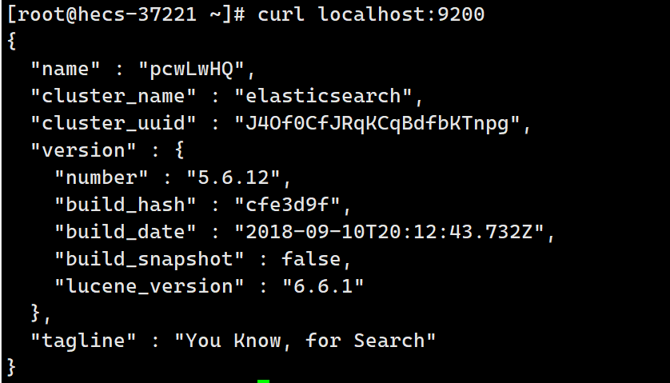

# 部署ElasticSearch + kibana存在的问题
	ES暴露的端口很多
	ES十分消耗内存
	ES的数据一般需要放置到安全目录 需要挂载？
	--net somenetwork ? 网络配置
# 部署并运行ElasticSearch
## 1、使用docker run命令启动es
```shell
docker run -d --name ElasticSearch  -p 9200:9200 -p 9300:9300 -e "discovery.type=single-node" elasticsearch:tag
```
## 2、查看es是否启动成功
```shell
curl localhost:9200
```

# 问题
Es十分耗内存的启动Es，整个Linux卡顿现象严重  
# 解决
## 1、使用docker stats 查看内存占用情况
```shell
docker stats
```

	可以观察到，仅Es启动，未执行操作，就已经占用了系统中61%的内存，导致系统卡顿，为了解决该问题，可以对Es进行内存占用的限制
## 2、修改配置文件，增加内存使用限制
```shell
docker run -d --name ElastiSearch1 -p 9200:9200 -p 9300:9300 -e "discovery.type=single-node" -e ES_JAVA_OPTS="-Xms64m -Xmx512m" elasticsearch:latest
```
## 3、再次查看内存占用情况


```shell
[root@hecs-37221 ~]# curl localhost:9200
{
  "name" : "1z7UWPE",
  "cluster_name" : "elasticsearch",
  "cluster_uuid" : "QMyTmOk_QrKxyYVUQYOv1w",
  "version" : {
    "number" : "5.6.12",
    "build_hash" : "cfe3d9f",
    "build_date" : "2018-09-10T20:12:43.732Z",
    "build_snapshot" : false,
    "lucene_version" : "6.6.1"
  },
  "tagline" : "You Know, for Search"
}

```