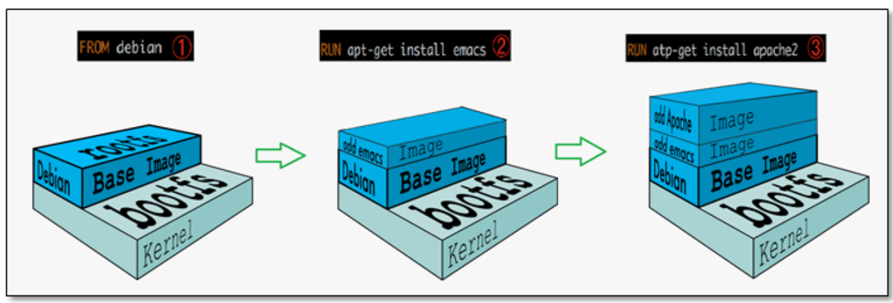
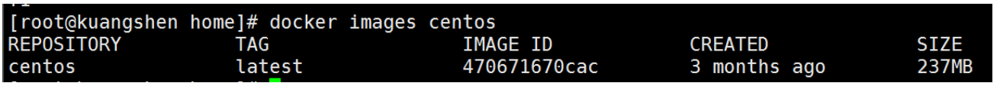
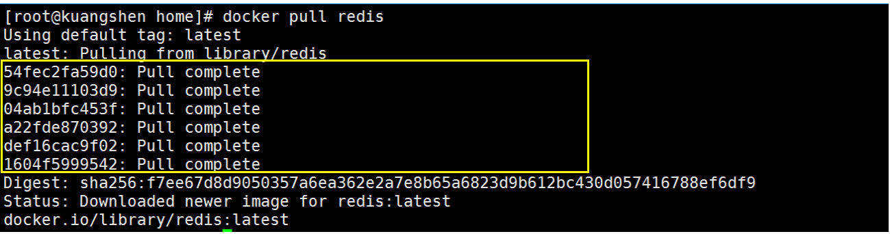
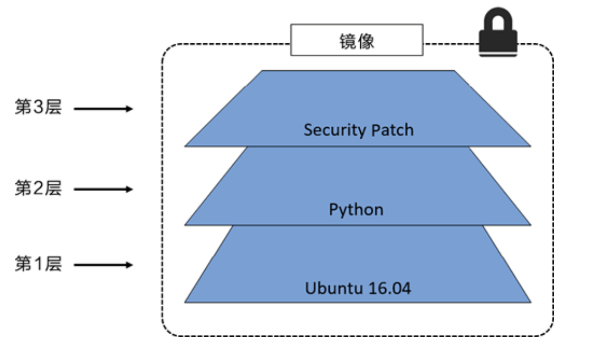
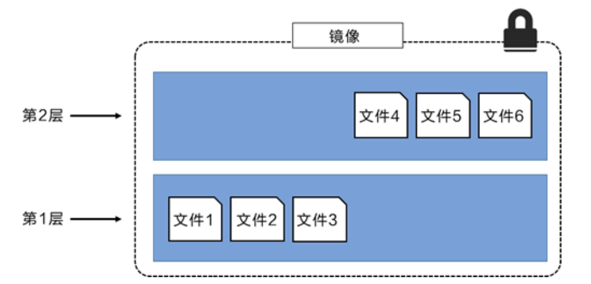
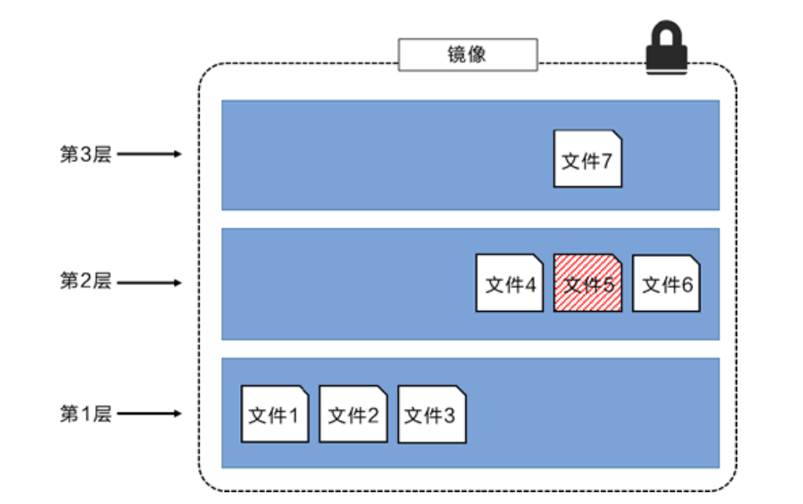
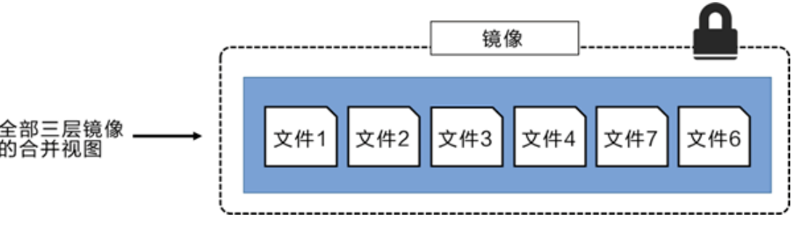

# 镜像是什么
镜像是一种轻量级、可执行的独立软件包，用来打包软件运行环境和基于运行环境开发的软件，它包含运行某个软件所需的所有内容，包括代码、运行时、库、环境变量和配置文件。
# docker镜像加载原理
>**联合文件系统**

UnionFS（联合文件系统）：Union文件系统（UnionFS）是一种分层、轻量级并且高性能的文件系统，它支持对文件系统的修改作为一次提交来一层层的叠加，同时可以将不同目录挂载到同一个虚拟文件系统下(unite several directories into a single virtual filesystem)。Union 文件系统是 Docker 镜像的基础。镜像可以通过分层来进行继承，基于基础镜像（没有父镜像），可以制作各种具体的应用镜像。特性：一次同时加载多个文件系统，但从外面看起来，只能看到一个文件系统，联合加载会把各层文件系统叠加起来，这样最终的文件系统会包含所有底层的文件和目录
>**Docker镜像加载原理**

docker的镜像实际上由一层一层的文件系统组成，这种层级的文件系统UnionFS。bootfs(boot file system)主要包含bootloader和kernel, bootloader主要是引导加载kernel, Linux刚启动时会加载bootfs文件系统，在Docker镜像的最底层是bootfs。这一层与我们典型的Linux/Unix系统是一样的，包含boot加载器和内核。当boot加载完成之后整个内核就都在内存中了，此时内存的使用权已bootfs转交给内核，此时系统也会卸载bootfs。
rootfs (root file system) ，在bootfs之上。包含的就是典型 Linux 系统中的 /dev, /proc, /bin, /etc 等标准目录和文件。rootfs就是各种不同的操作系统发行版，比如Ubuntu，Centos等等。

平时我们安装进虚拟机的CentOS都是好几个G，为什么Docker这里才200M？

对于一个精简的OS，rootfs 可以很小，只需要包含最基本的命令，工具和程序库就可以了，因为底层直接用Host的kernel，自己只需要提供rootfs就可以了。由此可见对于不同的linux发行版, bootfs基本是一致的, rootfs会有差别, 因此不同的发行版可以公用bootfs。
# 分层理解
>分层的镜像

我们可以去下载一个镜像，注意观察下载的日志输出，可以看到是一层一层的在下载！

思考：为什么Docker镜像要采用这种分层的结构呢？
最大的好处，我觉得莫过于是资源共享了！比如有多个镜像都从相同的Base镜像构建而来，那么宿主机只需在磁盘上保留一份base镜像，同时内存中也只需要加载一份base镜像，这样就可以为所有的容器服务了，而且镜像的每一层都可以被共享。
查看镜像分层的方式可以通过 docker image inspect 命令！

```shell
[root@kuangshen home]# docker image inspect redis:latest
[
// .....
"RootFS": {
"Type": "layers",
"Layers": [
"sha256:c2adabaecedbda0af72b153c6499a0555f3a769d52370469d8f6bd6328af9b13",
"sha256:744315296a49be711c312dfa1b3a80516116f78c437367ff0bc678da1123e990",
"sha256:379ef5d5cb402a5538413d7285b21aa58a560882d15f1f553f7868dc4b66afa8",
"sha256:d00fd460effb7b066760f97447c071492d471c5176d05b8af1751806a1f905f8",
"sha256:4d0c196331523cfed7bf5bafd616ecb3855256838d850b6f3d5fba911f6c4123",
"sha256:98b4a6242af2536383425ba2d6de033a510e049d9ca07ff501b95052da76e894"
]
},
"Metadata": {
"LastTagTime": "0001-01-01T00:00:00Z"
}
}
]
```
**理解**
所有的 Docker 镜像都起始于一个基础镜像层，当进行修改或增加新的内容时，就会在当前镜像层之上，创建新的镜像层。
举一个简单的例子，假如基于 Ubuntu Linux 16.04 创建一个新的镜像，这就是新镜像的第一层；如果在该镜像中添加 Python包，就会在基础镜像层之上创建第二个镜像层；如果继续添加一个安全补丁，就会创建第三个镜像层。该镜像当前已经包含 3 个镜像层，如下图所示（这只是一个用于演示的很简单的例子）。


在添加额外的镜像层的同时，镜像始终保持是当前所有镜像的组合，理解这一点非常重要。下图中举了一个简单的例子，每个镜像层包含 3 个文件，而镜像包含了来自两个镜像层的 6 个文件。

上图中的镜像层跟之前图中的略有区别，主要目的是便于展示文件。
下图中展示了一个稍微复杂的三层镜像，在外部看来整个镜像只有 6 个文件，这是因为最上层中的文件7 是文件 5 的一个更新版本。


这种情况下，上层镜像层中的文件覆盖了底层镜像层中的文件。这样就使得文件的更新版本作为一个新镜像层添加到镜像当中。
Docker 通过存储引擎（新版本采用快照机制）的方式来实现镜像层堆栈，并保证多镜像层对外展示为统一的文件系统。
Linux 上可用的存储引擎有 AUFS、Overlay2、Device Mapper、Btrfs 以及 ZFS。顾名思义，每种存储引擎都基于 Linux 中对应的文件系统或者块设备技术，并且每种存储引擎都有其独有的性能特点。
Docker 在 Windows 上仅支持 windowsfilter 一种存储引擎，该引擎基于 NTFS 文件系统之上实现了分层和 CoW[1]。
下图展示了与系统显示相同的三层镜像。所有镜像层堆叠并合并，对外提供统一的视图。


>特点

Docker镜像都是只读的，当容器启动时，一个新的可写层被加载到镜像的顶部！
这一层就是我们通常说的容器层，容器之下的都叫镜像层！


