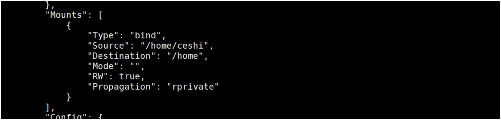
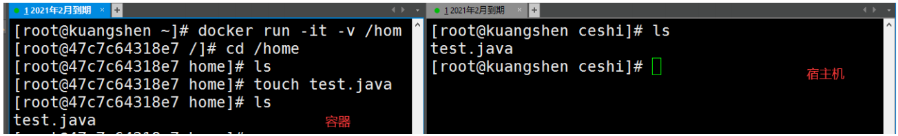
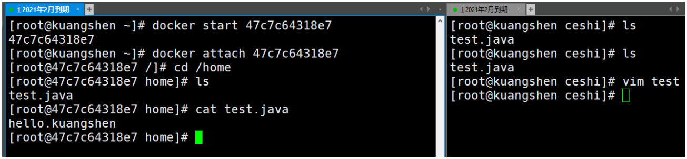

# 什么是容器数据卷
## docker的理念回顾
将应用和运行的环境打包形成容器运行，运行可以伴随着容器，但是我们对于数据的要求，是希望能够持久化的！
就好比，你安装一个MySQL，结果你把容器删了，就相当于删库跑路了，这TM也太扯了吧！
所以我们希望容器之间有可能可以共享数据，Docker容器产生的数据，如果不通过docker commit 生成新的镜像，使得数据作为镜像的一部分保存下来，那么当容器删除后，数据自然也就没有了！这样是行不通的！
为了能保存数据在Docker中我们就可以使用卷！让数据挂载到我们本地！这样数据就不会因为容器删除而丢失了！
**作用：**
卷就是目录或者文件，存在一个或者多个容器中，由docker挂载到容器，但不属于联合文件系统，因此能够绕过 Union File System ， 提供一些用于持续存储或共享数据的特性：
卷的设计目的就是数据的持久化，完全独立于容器的生存周期，因此Docker不会在容器删除时删除其挂
载的数据卷。
**特点：**
1、数据卷可在容器之间共享或重用数据
2、卷中的更改可以直接生效
3、数据卷中的更改不会包含在镜像的更新中
4、数据卷的生命周期一直持续到没有容器使用它为止
**所以：总结一句话： 就是容器的持久化，以及容器间的继承和数据共享！**

# 使用数据卷
>方式一、容器中直接使用命令来添加

挂载
```shell
# 命令
docker run -it -v 宿主机绝对路径目录:容器内目录 镜像名
# 测试
[root@kuangshen ~]# docker run -it -v /home/ceshi:/home centos /bin/bash
```
查看数据卷是否挂载成功 docker inspect 容器id

测试容器和宿主机之间数据共享：可以发现，在容器中，创建的会在宿主机中看到！

测试容器停止退出后，主机修改数据是否会同步！
1. 停止容器
2. 在宿主机上修改文件，增加些内容
3. 启动刚才停止的容器
4. 然后查看对应的文件，发现数据依旧同步！ok
