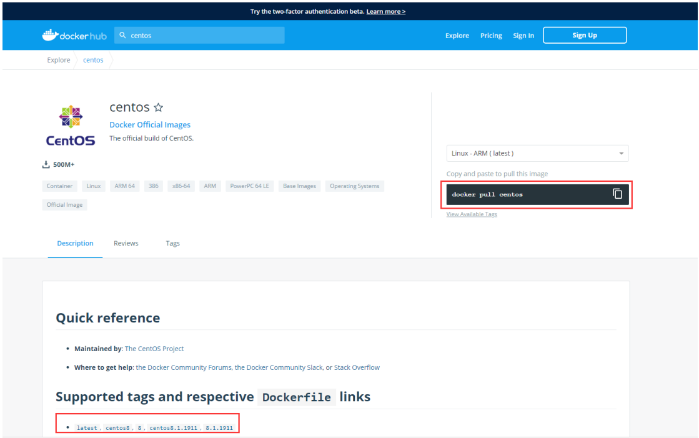
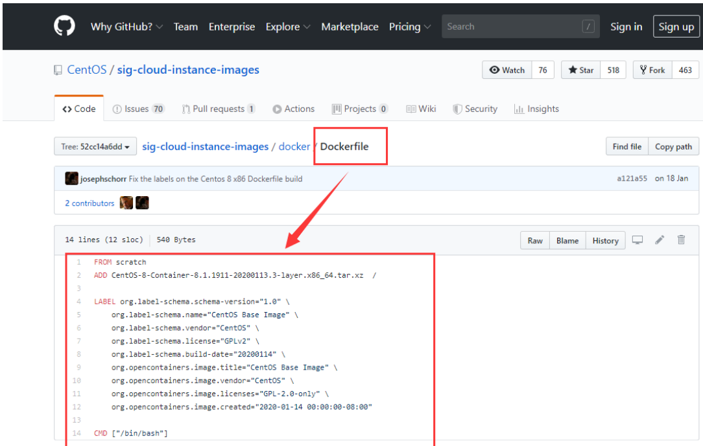
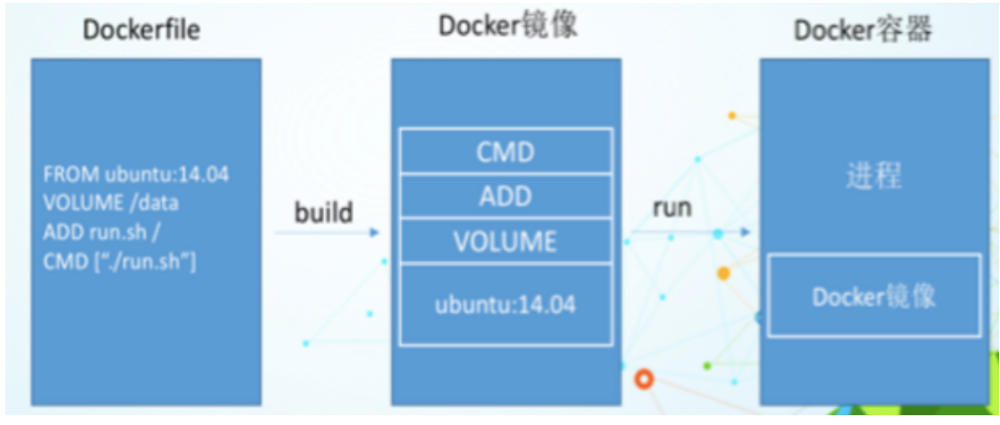

大家想想，Nginx，tomcat，mysql 这些镜像都是哪里来的？官方能写，我们不能写吗？
我们要研究自己如何做一个镜像，而且我们写的微服务项目以及springboot打包上云部署，Docker就是最方便的。
微服务打包成镜像，任何装了Docker的地方，都可以下载使用，极其的方便。
流程：开发应用=>DockerFile=>打包为镜像=>上传到仓库（私有仓库，公有仓库）=> 下载镜像 => 启动运行。还可以方便移植！

# 什么是DockerFile?
dockerfile是用来构建Docker镜像的构建文件，是由一系列命令和参数构成的脚本。
构建步骤：
1、编写DockerFile文件
2、docker build 构建镜像
3、docker run
dockerfile文件我们刚才已经编写过了一次，这里我们继续使用 centos 来看！
地址：https://hub.docker.com/_/centos

# DockerFile构建过程
**基础知识：**
1、每条保留字指令都必须为大写字母且后面要跟随至少一个参数
2、指令按照从上到下，顺序执行
3、# 表示注释
4、每条指令都会创建一个新的镜像层，并对镜像进行提交
**流程：**
1、docker从基础镜像运行一个容器
2、执行一条指令并对容器做出修改
3、执行类似 docker commit 的操作提交一个新的镜像层
4、Docker再基于刚提交的镜像运行一个新容器
5、执行dockerfile中的下一条指令直到所有指令都执行完成！
**说明：**
从应用软件的角度来看，DockerFile，docker镜像与docker容器分别代表软件的三个不同阶段。
DockerFile 是软件的原材料 （代码）
Docker 镜像则是软件的交付品 （.apk）
Docker 容器则是软件的运行状态 （客户下载安装执行）
DockerFile 面向开发，Docker镜像成为交付标准，Docker容器则涉及部署与运维，三者缺一不可！

DockerFile：需要定义一个DockerFile，DockerFile定义了进程需要的一切东西。DockerFile涉及的内容
包括执行代码或者是文件、环境变量、依赖包、运行时环境、动态链接库、操作系统的发行版、服务进
程和内核进程（当引用进行需要和系统服务和内核进程打交道，这时需要考虑如何设计 namespace的权
限控制）等等。
Docker镜像：在DockerFile 定义了一个文件之后，Docker build 时会产生一个Docker镜像，当运行
Docker 镜像时，会真正开始提供服务；
Docker容器：容器是直接提供服务的。
